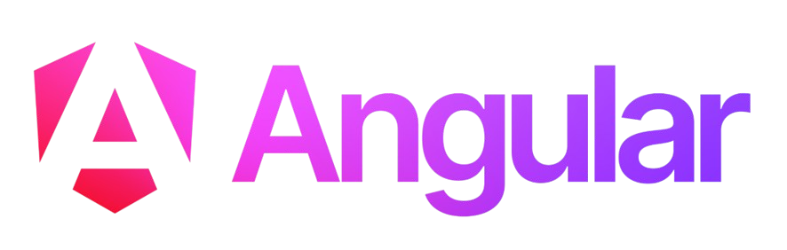

# Cursos de Angular

  

Este repositório contém os principais cursos de Angular realizados a fim de construir uma base sólida no framework.

## 📋 Lista de cursos
| Status | Nº    | Curso | Repositório | Deploy |
| :---:  | :---: | :---: |    :---:    | :---:  |
| ✅  | 1  | Matheus Battisti | [Acessar](https://github.com/MateusSKV9/angular-courses/tree/main/curso-loiane-groner) | - |
| 🚧  | 2  | Loiane Groner | [Acessar](https://github.com/MateusSKV9/angular-courses/tree/main/curso-matheus-battisti) | - |
| ✅  | 3  | Ralf Lima | [Acessar](https://github.com/MateusSKV9/angular-courses/tree/main/curso-ralf-lima) | [Acessar](https://curso-ralf-lima.vercel.app/) |
| ✅  | 4  | Café com Bug | [Acessar](https://github.com/MateusSKV9/angular-courses/tree/main/curso-cafe-com-bug) | [Acessar](https://curso-cafe-com-bug.vercel.app/) |
| ✅  | 5  | Code Dimension | [Acessar](https://github.com/MateusSKV9/angular-courses/tree/main/curso-code-dimension) | [Acessar](https://curso-code-dimension.vercel.app/) |
| 🚧  | 6  | Tour of Heroes | [Acessar](https://github.com/MateusSKV9/angular-courses/tree/main/curso-code-dimension) | [Acessar](https://curso-tour-of-heroes-bice.vercel.app/) |
